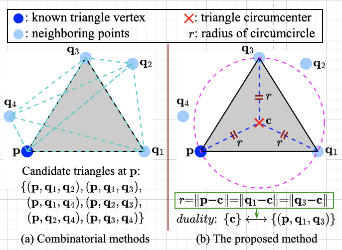
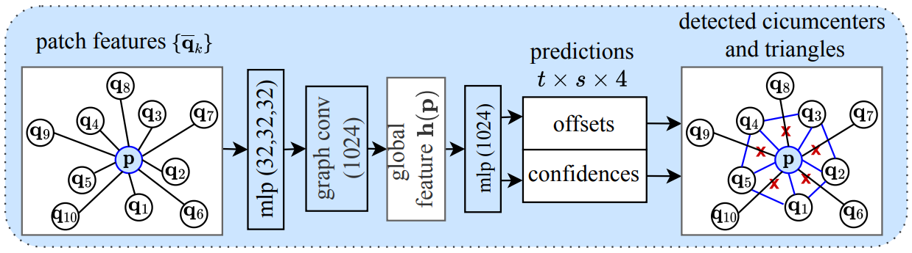
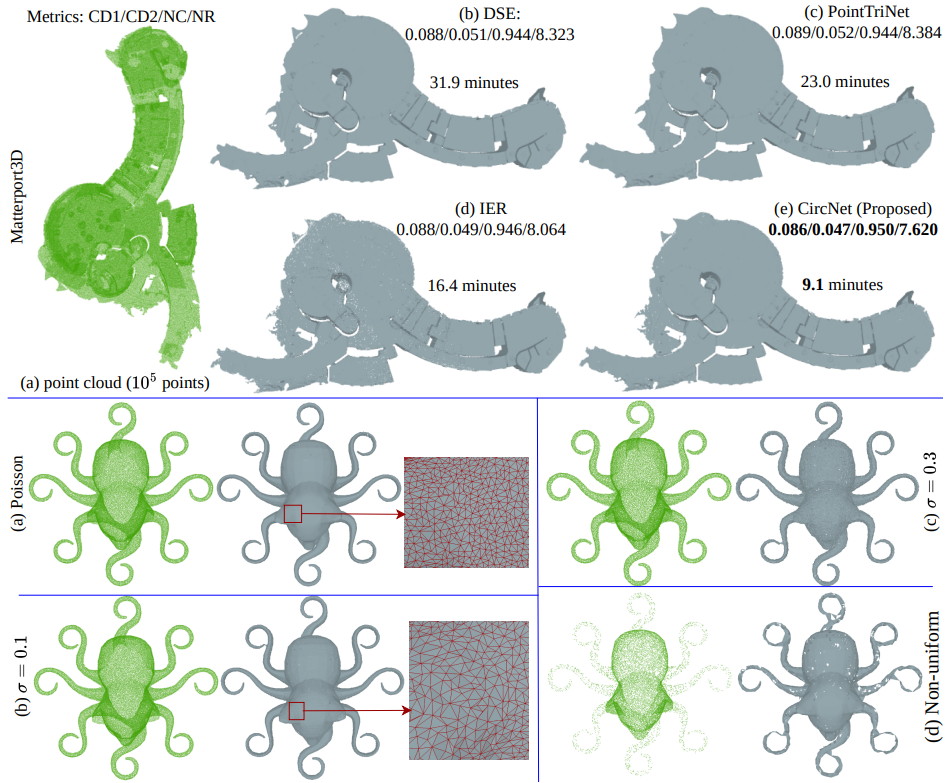
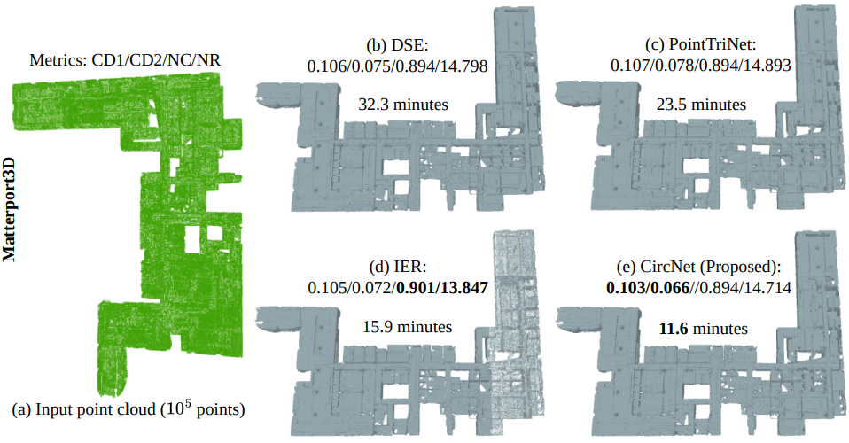
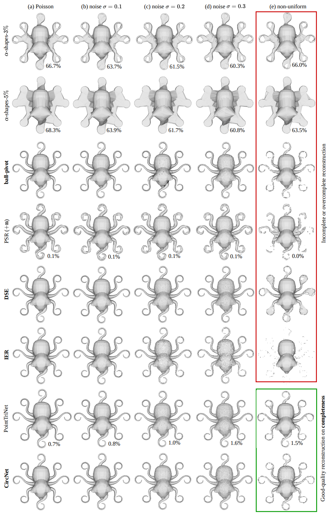
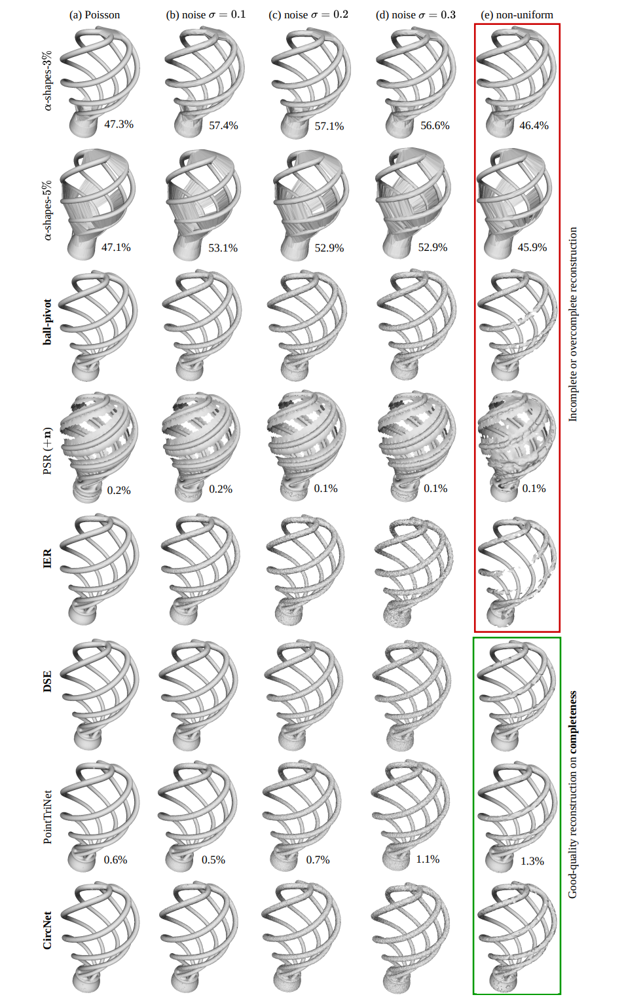

# <p align="center">CircNet: Meshing 3D Point Clouds with Circumcenter Detection</p>

## <p align="center">\[[Project page](https://aimlsa.github.io/CircNet/)\] \[[Open Review](https://openreview.net/forum?id=zQWqV2tzDv)\] \[[Arxiv](https://arxiv.org/abs/2301.09253)\]</p>

<p align="center">
    
    
</p>

<br>

## Introduction
Reconstructing 3D point clouds into triangle meshes is a key problem in computational geometry and surface reconstruction. Point cloud triangulation solves this problem by providing edge information to the input points. Since no vertex interpolation is involved, it is beneficial to preserve sharp details on the surface. Taking advantage of learning-based techniques in triangulation, existing methods enumerate the complete combinations of candidate triangles, which is both complex and inefficient. In this paper, we leverage the duality between a triangle and its circumcenter, and introduce a deep neural network that detects the circumcenters to achieve point cloud triangulation. Specifically, we introduce multiple anchor priors to divide the neighborhood space of each point. The neural network then learns to predict the presences and locations of circumcenters under the guidance of those anchors. We extract the triangles dual to the detected circumcenters to form a primitive mesh, from which an edge-manifold mesh is produced via simple post-processing. Unlike existing learning-based triangulation methods, the proposed method bypasses an exhaustive enumeration of triangle combinations and local surface parameterization. We validate the efficiency, generalization, and robustness of our method on prominent datasets of both watertight and open surfaces.


### Citation
If you find our work useful in your research, please consider citing:

```
@inproceedings{lei2023circnet,
      title={CircNet: Meshing 3D Point Clouds with Circumcenter Detection},
      author={Lei, Huan and Leng, Ruitao and Zheng, Liang and Li, Hongdong},
      journal={International Conference on Learning Representations},
      year={2023}
}
```

<br>

## Setup
### 1. Configure the environment
Tested on Ubuntu 22.04.2 LTS, Cuda 11.0, Tensorflow 2.5.0.

```
git clone https://github.com/EnyaHermite/CircNet
conda create --name tf python==3.8 -y
conda activate tf
pip install -r requirements.txt
cd codes/src
bash compile.sh
cd ../..
```            

### 2. Download the data
 Download our voxelized [ABC](https://deep-geometry.github.io/abc-dataset/) subset, the watertight human meshes of [FAUST](https://faust-leaderboard.is.tuebingen.mpg.de/), and the open garment meshes of [MGN](https://virtualhumans.mpi-inf.mpg.de/mgn/). We provide reorganize_MGN.py to re-organize the MGN dataset for convinient data loading.
```
cd data
bash download_extract_shapes.sh
python reorganize_MGN.py
```
- The Matterport3D dataset can be downloaded from [here](https://niessner.github.io/Matterport/#download) after regitration. 

<br>

## Experiments
### 1. Train the Model on ABC dataset
```
cd codes
python main_train.py --gpu=0
```

### 2. Meshing points clouds of the ABC test set
```
python main_evaluate.py --pcd_dir=../data/voxelized_ABC_0.01 --ckpt_epoch=80 --write_dir=../results/abc
python run_prim2manifold.py --read_path=../results/abc/primitive
```

### 3. Generalized meshing of unseen point clouds
```
python main_evaluate.py --pcd_dir=../data/MPI-FAUST/training/registrations/ --ckpt_epoch=80 --write_dir=../results/faust
python main_evaluate.py --pcd_dir=../data/MGN/ --ckpt_epoch=80 --write_dir=../results/mgn
python run_prim2manifold.py --read_path=../results/faust/primitive
python run_prim2manifold.py --read_path=../results/mgn/primitive
```

### 4. Compute the evaluation metrics to measure meshing quality
```
python compute_eval_metrics.py --gt_path=../data/voxelized_ABC_0.01 --pred_path=../results/abc/manifold
python compute_eval_metrics.py --gt_path=../data/MPI-FAUST/training/registrations/ --pred_path=../results/faust/manifold
python compute_eval_metrics.py --gt_path=../data/MGN/ --pred_path=../results/mgn/manifold
```

<br>

## Visualization
### 1. Our reconstruction of large-scale buildings, and complex shapes 



### 2. Comparison of different methods on reconstructing thin structures



